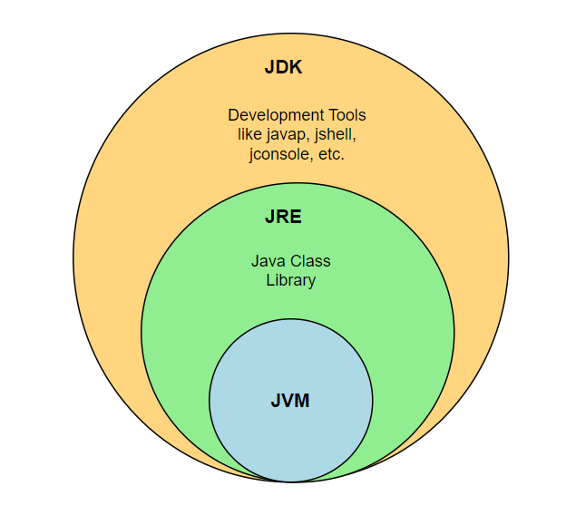
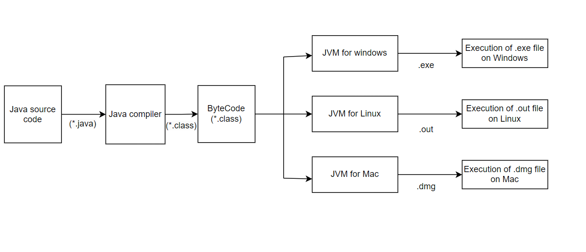
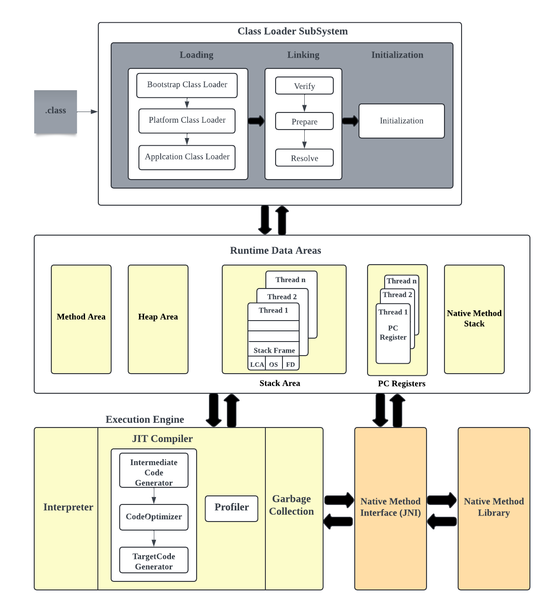
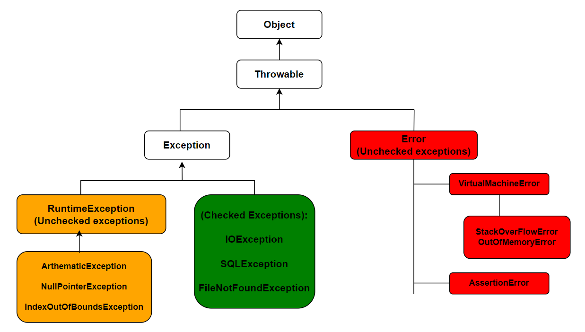
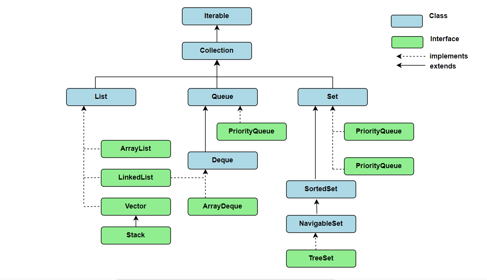

# java-interview-questions

Frequently asked Java Interview questions

### Table of Contents

<!-- TOC_START -->
| No. | Questions |
| --- | --------- |
| 1 | [What are the differences between JVM, JRE and JDK?](#what-are-the-differences-between-jvm-jre-and-jdk) |
| 2 | [Why Java is platform-independent language](#why-java-is-platform-independent-language) |
| 3 | [How does JVM works](#how-does-jvm-works) |
| 4 | [What are the main features of Java](#what-are-the-main-features-of-java) |
| 5 | [What is public static void main?](#what-is-public-static-void-main) |
| 6 | [What is string constant pool](#what-is-string-constant-pool) |
| 7 | [Why strings are immutable](#why-strings-are-immutable) |
| 8 | [What is the difference between StringBuffer and StringBuilder](#what-is-the-difference-between-stringbuffer-and-stringbuilder) |
| 9 | [What is the importance of hashCode() and equals() methods](#what-is-the-importance-of-hashcode-and-equals-methods) |
| 10 | [What is the difference between checked and unchecked expceptions](#what-is-the-difference-between-checked-and-unchecked-expceptions) |
| 11 | [What are wrapper classes](#what-are-wrapper-classes) |
| 12 | [Why java is not pure object oriented language](#why-java-is-not-pure-object-oriented-language) |
| 13 | [What is the difference between abstract class and interface](#what-is-the-difference-between-abstract-class-and-interface) |
| 14 | [What are marker interfaces](#what-are-marker-interfaces) |
| 15 | [What are collections in Java?](#what-are-collections-in-java) |
| 16 | [What are the differences between arraylist and vector?](#what-are-the-differences-between-arraylist-and-vector) |
| 17 | [What is finalize method? How do you override it?](#what-is-finalize-method-how-do-you-override-it) |
| 18 | [What Is the Difference Between the Comparable and Comparator Interfaces](#what-is-the-difference-between-the-comparable-and-comparator-interfaces) |
<!-- TOC_END -->

<!-- QUESTIONS_START -->

1. ### What are the differences between JVM, JRE and JDK?

   The main differences between JVM, JRE and JDK are listed below,

   **JVM:** Java Virtual Machine(JVM) is an abstract machine that provides a runtime environment for the execution of Java ByteCode. i.e, It is part of Java Runtime Environment(JRE) and responsible for converting bytecode into machine-readable code. JVM is platform dependent but it interprets the bytecode which is platform independent. As a result, Java applications to run on different platforms and operating systems.

   **JRE:** Java Runtime Environment (JRE) is an installation package that provides Java Virtual Machine (JVM), class libraries and other components to run the Java program or application on any machine.

   **JDK:** Java Development Kit (JDK) is a software development kit used to develop and execute Java programs. It includes tools for developing, monitoring and debugging java programs, along with JRE to execute those respective programs.

   The pictorial representation of these three components looks as follows,

   

   **[⬆ Back to Top](#table-of-contents)**

2. ### Why Java is platform-independent language

   Java is platform-independent language because java programs are compiled to a bytecode that can be run on any device or OS which has a Java Virtual Machine(JVM). This is possible due to JVM's "Write Once, Run Anywhere"(WORA) capability. Due to this reason, you can write a Java program on one platform such as Windows machine and then run it on a different platform such as macOS or Linux machine without making any modifications to the code.

   Below diagram explains the platform independence feature of Java,

   

   **[⬆ Back to Top](#table-of-contents)**

3. ### How does JVM works

   JVM(Java Virtual Machine) is an abstract runtime engine to run java applications. It is part of Java Runtime Environment(JRE) to execute the bytecode generated by java compilers. JVM brings WORA(Write Once Read Anywhere) behavior in which you can write java program on one system and expected to run on any java enabled systems without any modifications. Upon compiling .java file to .class file(contains byte code), .class file goes into severl steps described by JVM.

   JVM consists of three main components:

   1. Class Loader subsystem
   2. Runtime data area/ memory area
   3. Execution engine

   Let's understand the JVM architecture which includes the above three components,

   

   1. **Class Loader Subsystem:** The class loaders are responsible to load the class files dynamically into JVM during the runtime. The first class that loaded into the memory is usually the class that contains `main` method.This subsystem performs three main activities.

      1. **Loading:** As part of this step, the class loader will read the .class file and generate the corresponding bytecode. The following important information of the class file will be saved in method area of JVM.

         1. The Fully Qualified Class Name(FQCN) of the loaded class.
         2. Immediate parent class.
         3. Variables, method and modifier information
         4. Whether .class is related to Class, Interface or Enum.

         JVM also creates an object of **Class** type(available from **java.lang** package) to represent the file in the heap memory. But it will be created only on the very first time when the class file is loaded into JVM. This object is helpful for the developers to get class level information.

      2. **Linking:** Linking is the process of taking a class or interface and combining it into the runtime state of the Java virtual machine, preparing it for execution. It involves the following steps:

         1. **Verification:** This phase ensure the correctness of `.class` file by checking whether the file is properly formatted or not, and the code generated by a valid compiler or not. If the validation is failed, you will receive `java.lang.VerifyError` through **ByteCodeVerifier**.

         2. **Preparation:** In this step, JVM allocates memory for all static variables within classes/interfaces and assign them with default values.

         3. **Resolution:** In this step, all symbolic references to classes or interfaces are replaced with their actual memory locations. This transformation is known as **Dynamic Linking**.

      3. **Initialization:** This is the last phase of class loading, where all static variables are replaced with their original values and static block gets executed.

   There are three built-in classloaders available in Java:

   1. **Bootstrap ClassLoader:** This is a root class loader and typically represented as null. It loads the core java libraries located in <JAVA_HOME>/jmods folder like `java.lang`, `java.util` etc. This class loader is written in native code unlike other class loaders.

   2. **Platform ClassLoader:** This class loader is responsible for loading platform classes such as Java SE platform APIs, their implementation classes and JDK-specific run-time classes. For example, the platform classess such as `java.net.http`, `java.sql`, `org.graalvm.compile`(JDK Specific).

   3. **System/Application classLoader:** This class loader is responsible for loading all the classes configured from the classpath. The classpath can contain classes from directories, JAR files etc.

   The above class loaders follows a class loader hierarchy ensuring a delegation mechanism. That means, if the class is loaded and its not found by application classloader, the request is delegated upwards to the platform application class loader. But even it is not found by platform class loader then further delegate upwards to Bootstrap class loader.

   **Note:** Apart from the above built-in class loaders, you can also create your own user defined class loader for ensuring application independence. For example, Tomcat webserver use this approach(WebAppClassLoader) to ensure that different web applications to load and isolate classes/jars.

   2. **Runtime data area/ memory area:**

      The runtime data areas are mainly divided into five components,

      1. **Method:** The method area stores below class level information,

         1. ClassLoader reference
         2. Runtime constant pool
         3. Field data such as name, type, modifiers, attributes etc of each field.
         4. Method data such as name, return type, modifiers, attributes, parameter types etc of each field.
         5. Constructor data such as parameter types and their order for each constructor.

      This is a shared resource and only one method area is available per JVM.

      2. **Heap:** This is the runtime data area in which all the objects and their respective instance variables are stored. The heap is created upon JVM startup and there is only one heap per JVM.

      3. **Stack:** Each thread which is created in JVM, a separate runtime-stack is also created at the same time. The local variables, method calls and intermediate results are stored in this stack area. But if the thread requires a larger stack size than what is available, JVM throws `StackOverflow` error.

      For each method call, a stack frame is created in the stack memory area and it is going to be destroyed upon method execution gets completed. Each stack frame is further divided into three sections.

      1. **Local variables:** For each frame, all the local variables and their values are stored in an array format.
      2. **Operand stack:** In each frame, the variables and operators required for mathematical operations are stored in LIFO stack.
      3. **Frame data:** This area holds all symbolic references related to constant pool resolution and method returned data. It is also used to store a reference to the exception table which has all the information related to catch block in case of exceptions.

      **Note:** Stack area is not a shared resource.

      4. **PC Registers:** JVM supports multiple threads at the same time and each thread has separate PC registers. These registers are used to store address of the currently executed JVM instruction. After completion of current instruction, PC register is going to be updated with next instruction.

      5. **Native method stack:** This stack is used to hold the information related to native methods written in C, C++ and Assembly.

   3. **Execution engine:** The execution engine is responsible for executing the bytecode that is loaded into the JVM. It communicates with various runtime data memories of JVM during the execution. Once the program is finished executing, the memory in the runtime data area will be released.

      It contains three main components for executing the class files.

      1. **Interpreter:** The interpreter reads and executes the bytecode instructions line by line to convert into respective machine language instructions. The main advantage of interpreter is that it is very quick to load and execute the code in a faster pace. But whenever it executes the same code blocks again and again, the interpreter executes repeatedly. So the interpreter cannot be optimized the runtime in case of repeated code execution.

      2. **JIT compiler:** Just-In-Time Compiler(JIT Compiler) is introduced to overcome the disadvantages of interpreter, especially with repeated code execution. JIT compiler can remember the repeated code block segments and they will stored as native code in the cache. Whenever JIT compiler reads the same code block again, it will use the native code stored in the cache.

      JIT compiler has further divided into the following components,

      1. **Intermediate Code Generator:** It generates intermediate code.
      2. **Code Optimizer:** It optimizes the intermediate code for better performance.
      3. **Target Code Generator:** It converts intermediate code into native machine code.
      4. **Profiler:** This is used to identify Hotspots(i.e, repeatedly executing methods) and replace hotspots with respective native code.

      5. **Garbage Collector:** Garbage Collector(GC) is responsible to collect and remove unreferenced objects from the heap area. This memory management feature is used to reclaim the unused memory and makes free space for newer objects. This happens in two phases:

         1. **Mark:** In this step, GC identifies the unused objects in memory
         2. **Sweep:** As part of this step, GC removes the objects indentified in the previous phase.

   4. **Java Native Interface (JNI) :** JNI is used as a bridge between java method calls and native libraries written in C, C++ etc. Sometimes it is required to invoke native code for specific underlined hardeware.
   5. **Native Method Libraries :** These are collection of native libraries(C/C++/Assembly) which are required by execution engine. These libraries loaded through JNI and represented in the form of `.dll` or `.so` files.

   **[⬆ Back to Top](#table-of-contents)**

4. ### What are the main features of Java

   Java has many important features which makes it unique among the popular programming languages. Some of those features are:

   1. **Simple:** Java is a simple programming language and easy to understand without any complexities unlike in the prior programming languages.
      Some of the reasons for simplicity are: 1. It is based on C++ which makes it easy for new developers to learn it quickly. 2. Java doens't support pointers(unlike C or C++) considering its complexity and security vulnerabilities. Also, operator overloading doesn't exist in Java. 3. There is no need to remove unreferenced objects because it will be taken care by Automatic Garbage Collection.

   2. **Object-oriented:** Java is an Object Oriented programming(OOPS) language, which means everything in Java is represented with different types of classes and objects. This OOPS is a methodology that simplifies software development and maintenance by following the below features.

      1. Abstraction
      2. Encapsulation
      3. Inheritance
      4. Polymorphism

   3. **Portable:** Java is portable because the bytecode generated on one machine can be taken to any platform for the execution.

   4. **Platform Independent:** The java compiler converts the source code to bytecode and then JVM executes the bytecode to produce the output. If you compile a java program on specific operating system(let's say Windows), it can run on any other platform(Windows, Linux or Mac) with that platform specific JVM. This is the reason why we call Java as a platform-independent language.

   5. **Robust:** Java is robust with many safe guards to ensure reliable code. It has the below safe guards,

      1. It is capable of handling unexpected termination of a program through exception handling feature.
      2. It provides strong memory management through Garbage Collector from JVM, which collects all the unused variables and objects to free up the memory space. Whereas in prior programming languages, programmers are solely responsible for allocating and deallocating memory spaces.

   6. **Secured:** Java is extremely safe due to various features listed below,

      1. There are no explicit pointers. So you cannot access out-of-bound array. If you still try to access an array, it will show an `ArrayIndexOutOfBound` Exception. So it is impossible to exploit in Java with security flaws like stack corruption or buffer overflow.
      2. The programs runs in an secured environment(JVM) that is independent of operating system(OS).
      3. Java has bytecode verifier that checks the code blocks for any illegal code that violates the access right to objects.

   7. **Distributed:** Java supports the creation of distributed applications by using Remote Method Invocation(RMI) and Enterprise Java Beans. The java programs are easily distributed on one or more systems through internet connection.

   8. **Multi-threaded:** Java supports multithreading feature, which allows concurrent execution of several parts of a program for maximum utilization of the CPU. This is possible through multiple threads running the program simultaneously.

   9. **Compiled and Interpreted:** It provides both compilation and interpretation of programs. The programs are compiled by compiler first and the generated bytecode is going to be interpreted.

   10. **High performance:** Java bytecode is close to native code, so it runs more quickly than other conventionally interpreted programming languages. Ofcourse, it is not as fast as compiled languages like C or C++. JVM also uses JIT compiler which enables high performance through below features.
   11. Method inlining
   12. Dead code elimination
   13. Null check elimination
   14. Constant folding

   **[⬆ Back to Top](#table-of-contents)**

5. ### What is public static void main?

   The `main()` method acts as a starting point for JVM to start the execution of a Java program. i.e, JVM doesn't execute the code if there is no main method in the code. The signature of main method should follow specific pattern for the JVM to recognize it as a entry point. Since it is an important method of Java, you need to have proper understanding of its signature in detail.

   The signature of main method for displaying "Hello World" looks like below,

   ```java
   public static void main(String[] args) {
        System.out.println("Hello World");
   }
   ```

   When `java.exe` parses the command line, it generates a new String array and invokes the main() method. Let's describe each word in the statement,

   1. Public: The public access modifier is accessible everywhere and it enables JVM can invoke it from outside the class as it is not present in the current class. Otherwise, you will receive an error saying "Main method not found in class".

   2. Static: This static keyword is used to make `main()` method as a class related method so that JVM can invoke it without instantiating the class. It is also helpful to avoid unnecessary memory usage with object just for calling main method.

   3. Void: The void keyword is used to specify that a method doesn’t return anything. Since main() method doesn't return anything, its return type is void. Once the main method terminates, the java program terminates as well.

   4. Main: The "main" method name is an identifier that the JVM looks for as the starting point of the Java program.

   5. String[] args: This is an array of strings which stores arguments passed by command line while starting a program.

   **Note:** You can create any number of main methods through overloading features. i.e, Mulitple main methods can be created with different parameters.

   **[⬆ Back to Top](#table-of-contents)**

6. ### What is string constant pool

   String constant pool is a storage space inside the heap memory area where string literals are stored. It is also known as String pool or String Intern Pool. This is privately maintained by String class and it is empty by default. Whenever you create a new string object, JVM checks for presence of string object in the string pool. If the string value is already present, the same object reference is shared with the variable, else a new string is created in the pool with the variable reference stored in stack area.

   **[⬆ Back to Top](#table-of-contents)**

7. ### Why strings are immutable

   Strings are immutable, that means the contents of string objects can't be modified after their creation. i.e, When you try to alter the string, it creates a new string. Due to this behavior, the internal state of a string remains the same throughout the execution of the program. This characteristic of immutability helps with the benefits of caching, security, synchronization, and performance.

   **[⬆ Back to Top](#table-of-contents)**

8. ### What is the difference between StringBuffer and StringBuilder

   String is an immutable class to represent sequence of characters. Java also provided mutable version of String class through StringBuffer and StringBuilder. Even though both these classes are mutable, there are many differences between StringBuffer and StringBuilder.

   Some of the major differences in a tabular form:

   | StringBuffer                                                                                                                     | StringBuilder                                                                                                                            |
   | -------------------------------------------------------------------------------------------------------------------------------- | ---------------------------------------------------------------------------------------------------------------------------------------- |
   | StringBuffer was introduced in Java 1.0 version                                                                                  | StringBuilder was introduced in Java 1.5 version                                                                                         |
   | StringBuffer is synchronized(thread safe). That means two or more threads cannot call the methods of StringBuffer simultaneously | StringBuilder is non-synchronized(not thread safe). That means two or more threads can call the methods of StringBuilder simultaneously. |
   | Due to Synchronization, StringBuffer is slower than StringBuilder                                                                | StringBuilder is faster than StringBuffer because there won't be any preliminary checks for multiple threads                             |

   **[⬆ Back to Top](#table-of-contents)**

9. ### What is the importance of hashCode() and equals() methods

   Since both `equals()` and `hashCode()` methods are available in Object class(i.e, Java.lang.object), every java class gets the default implementation of equals and hashCode methods. These methods work together to verify if two objects have the same value or not.

   **1. equals:** The `equals()` method is used to compare equality of two Objects. By default their implementation compares the identities of the object. The Object class defined `equals()` method as follows,

   ```java
   public boolean equals(Object obj) {
       return (this == obj);
   }
   ```

   There are some rules need to be followed to use equals method:

   1. **Reflexive:** For any object x, `x.equals(x)` should return `true`.
   2. **Symmetric:** For any two objects x and y, `x.equals(y)` should return `true` if and only if `y.equals(x)` returns `true`.
   3. **Transitive:** For multiple objects x, y, and z, `if x.equals(y)` returns `true` and `y.equals(z)` returns `true`, then `x.equals(z)` should return `true`.
   4. **Consistent:** For any two objects x and y, multiple invocations of `x.equals(y)` should return same result(`true` or `false`), unless any of the object properties is modified that is being used in the equals() method implementation.

   **2. hashCode:** The `hashCode()` method returns the integer hash code value of the object. This method must be overridden in every class which overrides `equals()` method. The general contract of hashCode is:

   1. While execution of the application, the multiple invocations of `hashCode()` on the object should return the same integer value, unless the object property used in the `equals()` method is being modified.
   2. During the multiple executions of the application, the object's hashCode can change.
   3. If two objects are equal based on `equals()` method, then their object's hash code must be same.
   4. If two objects are unequal based on `equals()` method, their hash code value may or may not be equal.

   Together, the implementation of `equals()` and `hashCode()` should follow these rules.

   1. If `x.equals(y)` is true, then `x.hashCode() === y.hashCode()` should always be true.
   2. If `x.hashCode() === y.hashCode()` is true, then it doesn't required to be `x.equals(y)` always true.

   **[⬆ Back to Top](#table-of-contents)**

10. ### What is the difference between checked and unchecked expceptions

    An exception is an event that interrupts the normal flow the program execution. There are two types of exceptions,

    1. Checked exceptions
    2. Unchecked exceptions

    The hierarchical structure of exceptions is categorized as shown below,

    

    The exceptions which are checked at compile time are known as checked exceptions. If some code inside a method throws this checked exception, then either you need to handle(or caught) the exception using **try/catch** block or declare in the method signature using **thows** keyword.

    Some of the common checked exceptions are,

    1. IOException
    2. FileNotFoundException
    3. ClassNotFoundException
    4. InterruptedException
    5. SQLException
    6. ParseException

    For example, the following class has two methods which throws checked(`FileNotFoundException`) exceptions from FileInputStream constructor. This is due to accessing input file which doesn't exist. You can handle them either using try/catch block or declaring thows keyword in the method signature.

    ```java
        import java.io.*;

        class MyCheckedExceptions {

            private void methodWithTryCatch() {
                    File file = new File("non_existing_file.txt");
                    try {
                        FileInputStream stream = new FileInputStream(file);
                    } catch (FileNotFoundException e) {
                        e.printStackTrace();
                    }
            }

            private void methodWithThrows() throws FileNotFoundException {
                    File file = new File("non_existing_file.txt");
                    FileInputStream stream = new FileInputStream(file);
            }

        }
    ```

    Whereas the exceptions which are not checked at compile time are known as unchecked excpetions. All the exceptions under Error and RuntimeException comes under unchecked exceptions.

    Some of the common unchecked exceptions are,

    1. NullPointerException
    2. ArrayIndexOutOfBoundsException
    3. ArithmeticException
    4. NumberFormatException
    5. IllegalThreadStateException

    For example, the following method doesn't have any errors during compile time. But it will throw `ArithmeticException` during runtime because of division by zero.

    ```java
    class MyUncheckedException {

        private void divideByZero() {
    	    int a = 1;
    	    int b = 0;
    	    int result = a / b;
        }

    }
    ```

    **[⬆ Back to Top](#table-of-contents)**

11. ### What are wrapper classes

    Wrapper classes provides the mechanism to convert primitive types into object types and vice versa. Since Java is an object-oriented programming language, and many APIs and libraries in Java require objects instead primitive types. For example, data structures in collection framework, utility classes from `java.utils.*`,cloning process, Serialization, Synchronization etc require object type.

    The following table represent primitives and their respective wrapper classes.

    | Primitive data type | Wrapper class |
    | ------------------- | ------------- |
    | byte                | Byte          |
    | short               | Short         |
    | int                 | Integer       |
    | float               | Float         |
    | double              | Double        |
    | long                | Long          |
    | boolean             | Boolean       |
    | char                | Char          |

    You can use `.valueOf` methods from wrapper classes to convert primitive to object type, and the same way wrapper class methods like `intValue`, `doubeValue` etc used to convert wrapper class to primitive type. But this manual process can be automated.

    1. **autoboxing**

    The automatic conversion of primitive to object(corresponding wrapper class) is known as **autoboxing**. The following example demonstrate how the conversion works,

    ```java
    public class AutoboxingDemo{
        public static void main(String args[]){
            int num = 10;
            Integer x = Integer.valueOf(num); // Converting primitive int into Integer explicitly
            Integer y = num; // Autoboxing without explicit conversion

            System.out.println("x = "+ x + " y " + y);
        }
    }
    ```

    2. **unboxing**
       The automatic conversion of wrapper class to primitive is known as **unboxing**. The following example demonstrate both manual and automatic conversion,

    ```java
    public class UnboxingDemo{
       public static void main(String args[]){
           Integer num = new Integer(3);
           int x = num.intValue(); //Converting Integer to int explicitly
           int y = num; //Unboxing without manual conversion

           System.out.println("x ="+ x + "y = "+y);
       }
    }
    ```

    **Note:** These autoboxing and unboxing features are available from JDK1.5 version onwards.

    **[⬆ Back to Top](#table-of-contents)**

12. ### Why java is not pure object oriented language

    Java is not a fully object-oriented programming language because of two main reasons.

    1. It supports primitive data types like int, byte, long, short, etc., which are not objects. Even though you can convert primitive data types to objects using wrapper classes, it does not make Java a pure object-oriented language. Because these objects are not originally associated with Java and internally it uses operations like Unboxing and Autoboxing. That means even you use wrapper classes, under the hood it uses primitive types for the calculation.

    2. Both static variables and methods can be accessed without using an object. Instead, they are associated with classes, which is against to the object-oriented principle where everything should be an object.

    **[⬆ Back to Top](#table-of-contents)**

13. ### What is the difference between abstract class and interface

    Both Abstract class and interface are used to define contracts in object-oriented programming. But there are some key differences between them as shown below,

    | Abstract class                                                                                          | Interface                                                                                                          |
    | ------------------------------------------------------------------------------------------------------- | ------------------------------------------------------------------------------------------------------------------ |
    | The `abstract` keyword is used to declare abstract class and it can be extended using `extends` keyword | The `interface` keyword is used to declare interface and it can extend another interface only.                     |
    | The abstract class contains abstract and non-abstract methods                                           | Interface can have abstract methods only. But it is possible to have default and static methods from Java8 onwards |
    | It supports final, non-final, static and non-static variables                                           | It supports only final and static variables.                                                                       |
    | It doens't support multiple inheritance                                                                 | Interface supports multiple inheritance                                                                            |
    | It can have access modifiers such as public, protected, and private for their methods and properties    | It can only have public access                                                                                     |

    **Note:** Both Abstract class and interfaces cannot be instantiated.

    **[⬆ Back to Top](#table-of-contents)**

14. ### What are marker interfaces

    Marker interfaces are interfaces that don't have any fields, methods, or constants inside of it. They are also known as empty interfaces or tag interfaces. Examples of marker interface are Serializable, Cloneable and Remote interface. The purpose of marker interfaces are to provide run-time type information about an object to JVM and Compiler. They are mainly used in API development and in frameworks like Spring to provide additional information to the class.

    Some of the commonly used built-in marker interfaces are:

    1. **Cloneable:** It is available in `java.lang` package. If we try to clone an object that doesn’t implement this marker interface, the JVM throws a `CloneNotSupportedException`. i.e, This marker interface is used as a signal/indicator to the JVM that it is legal to call the `Object.clone()` method.
    2. **Serializable:** It is available in `java.io` package. When we try to write an object to output stream using `ObjectOutputStream.writeObject()` method without implementing this marker interface, JVM throws an exception named `NotSerializableException`.
    3. **Remote:** It is available in `java.rmi` package. A remote object can be accessed from another machine if and only if the class has implemented this marker interface. Otherwise, it is going to throw exception named `RemoteException`.

    For example, the cloneable marker interface looks like below,

    ```java
    public interface Cloneable {
       // nothing here
    }
    ```

    and the following student class implements Cloneable interface to make a copy of student's object.

    ```java
    import java.lang.*;

    class Student implements cloneable {

        String name = null;
        int age = 0;

        Student(String name, int age) {
            this.name = name;
            this.age = age;
        }

        @Override
        protected Object clone() throws CloneNotSupportedException {
            return super.clone();
        }

        public static void main(String[] args) {

            Student s1 = new Student("Sudheer", 30);
            //Create clone of s1 object
            try {
                Student s2 = s1.clone();
            } catch (Exception e) {
                System.out.println(s2.toString());
            }
        }
    }

    ```

    There are also alternatives for marker interfaces.

    1. **Internal flags:** They can be used in place of marker interface to indicate any specific operation.
    2. **Annotations:** They are used as tags to represent the metadata attached to classes, interfaces, or methods to indicate additional information required by JVM.

    **[⬆ Back to Top](#table-of-contents)**

15. ### What are collections in Java?

    Collections in Java is a unified framework that provides architecture for storing and manipulating a group of objects.

    The `java.util.*` package contains the following classes and interfaces for Collections framework.

    

    **[⬆ Back to Top](#table-of-contents)**

16. ### What are the differences between arraylist and vector?

    Both Vector and ArrayList use dynamically resizable array as their internal data structure and implement the List interface. But there are couple of differences between them as listed below,

    | ArrayList                                                                                     | Vector                                                                                      |
    | --------------------------------------------------------------------------------------------- | ------------------------------------------------------------------------------------------- |
    | This data structure is part of Collection framework, introduced in JDK 1.2                    | This is a legacy class                                                                      |
    | The capacity increment of ArrayList is 50% if the number of elements exceeds the current size | The capacity increment of Vector is 100% if the number of elements exceeds the current size |
    | It is not synchronized by default. That means multiple threads can access it concurrently.    | It is synchronized by default. That means only one thread can access it at a time.          |
    | It is quite fast because it is not synchronized                                               | It is quite slow due to synchronization                                                     |
    | ArrayList uses the Iterator interface to traverse over the elements.                          | Vector uses both the Iterator and Enumeration interfaces to traverse over the elements.     |

    **[⬆ Back to Top](#table-of-contents)**

17. ### What is finalize method? How do you override it?

    The `finalize()` is a method from the Object class used to perform cleanup activity before destroying any object. The method is invoked by garbage collector for cleanup activities like closing the resources associated with an object(database connection or network connection). This process is known as **finalization** and it helps JVM for in-memory optimization.

    It is a protected method of Object class with syntax as shown below,

    ```java
    protected void finalize() throws Throwable{}
    ```

    Since Object is the superclass of all java classes, the finalize method is available for every java class. That's why garbage collector can call the `finalize()` method on any java object.

    This method has empty implementation inside Object class. If your class has clean-up activities, you need to override this method. The following example demonstrate how to override the finalize method and call the method explicitly.

    ```java
    import java.lang.*;

    public class finalizeDemo {

        protected void finalize() throws Throwable {
                try {

                    System.out.println("Inside finalize() method of finalizeDemo class");
                }
                catch (Throwable e) {

                    throw e;
                }
                finally {

                    System.out.println("Calling finalize method of the Object(super) class");

                    super.finalize();
                }
        }

        public static void main(String[] args) throws Throwable {
            finalizeDemo fd = new finalizeDemo();
            fd.finalize();
        }
    }
    ```

    The statement `super.finalize()` is called inside finally block to ensure its execution even in the case of exceptions.

    **Note:** The garbage collector invokes the `finalize()` method only once on any object.

    **[⬆ Back to Top](#table-of-contents)**

18. ### What Is the Difference Between the Comparable and Comparator Interfaces

    Java provides Comparable and Comparator interfaces for sorting the collection of objects, but they serve different purposes and are used in different scenarios. 

    **Comparable:**
    The Comparable interface is capable of comparing an object with another object of same type. The class which needs to compare its instances has to implement `java.lang.Comparable` interface.
    It can be used to provide **single way of sorting**. That means that the objects can be sorted based on a single data member. For example, Employee object can be sorted based on single attributes like id, name, age etc.

    If the class implements Comparable interface, it knows how to sort the objects because the same class itself has implemented compareTo method. This type of sorting is called **default or natural sorting**. The class can compare its object by overriding compareTo method with syntax as shown below,

    ```java
    class T implements Comparable<T> {
        @Override
        public int compareTo(T t) {
            // comparasion logic goes here
        }
    }
    ```

    For example, group of employees sorted based on their name attribute using Comparable interfaces as follows

    ```java
    import java.util.*;

    class Employee implements Comparable<Employee> {
        private final String id;
        private final String name;
        private final int age;
        
        public Employee(String id, String name, int age) {
            this.id = id;
            this.name = name;
            this.age = age;
        }
        
        @Override
        public int compareTo(final Employee employee) {
            return this.name.compareTo(employee.name);
        }
        
        public String getId() { return this.id; }
        
        public String getName() { return this.name; }
        
        public int getAge() { return this.age; }
        
        @Override
        public String toString() {
            return String.format("ID: %s | Name: %s | Age: %d", id, name, age);
        }
    }

    public class Main {
        public static void main(String[] args) {
            List<Employee> employees = new ArrayList<>();

            employees.add(new Employee("3", "John", 32));
            employees.add(new Employee("1", "James", 27));
            employees.add(new Employee("2", "Jackson", 22));
            
            Collections.sort(employees);

            employees.forEach(employee -> 
                                System.out.println(employee.toString()));
        }
    }
    ```
    **Comparator:**

    The comparator is a functional interface used to sort objects and it provides **multiple sorting sequence** in which objects sorted based on multiple data members. This interface is available as part of `java.util` package.  For example, Employee object can be sorted based on multiple attributes like id, name, age etc.

    The comparator is used for custom ordering where the class is not aware about the sorting logic. The comparator can be created using a lambda expression that accept two objects of given type and return an integer value(i.e, 1, 0, -1) based on ordering with syntax as shown below,

    ```java
     Comparator<T> comparator = (T t1, T t2) -> { 
        //comparison logic 
     }
    ```

    You can create multiple separate classes (which implement Comparator interface) to compare by different members.The Comparator provides the compare() method which can be overriden to customize the comparison logic. For example, group of employees sorted based on id and age data members even though Employee class overridden the compareTo method.

    ```java
    public static void sortById(List<Employee> employees) {
        Comparator<Employee> idComparator = (Employee e1, Employee e2) -> {
            return e1.getId().compareTo(e2.getId());
        };
        
        employees.sort(idComparator);
    }
    
    public static void sortByAge(List<Employee> employees) {
        Comparator<Employee> ageComparator = (Employee e1, Employee e2) -> {
            return e1.getAge() - e2.getAge();
        };
        
        employees.sort(ageComparator);
    }
    ```

    In the above example, idComparator and ageComparator have been created to perform custom sorting. These comparators needs to be passed as an argument to sort method.
    
    **Note:** It is preferred to use lambda expression to create Comparator because it is a functional interface(exactly one abstract method).


    **[⬆ Back to Top](#table-of-contents)**

<!-- QUESTIONS_END -->
